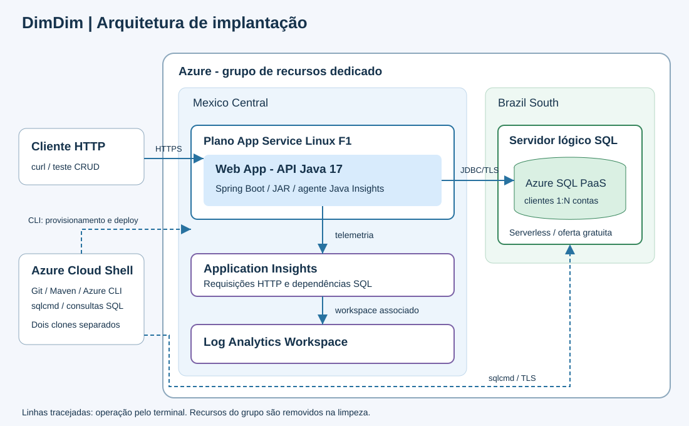
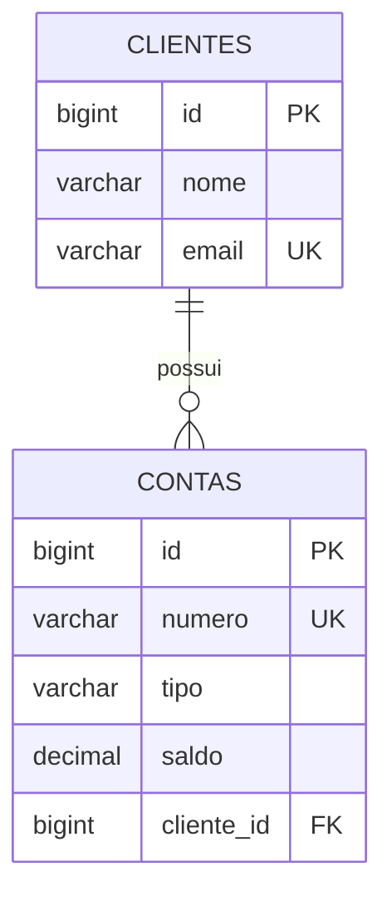

# DimDim CP5 — Automação Azure CLI

Repositório de automação do projeto **DimDim**, desenvolvido para o **2º Checkpoint do 2º Semestre de DevOps Tools & Cloud Computing**. Os scripts provisionam e configuram a infraestrutura Azure, compilam e publicam a aplicação, testam o CRUD, consultam a telemetria e removem os recursos. O código Java e o frontend integrado ficam no repositório separado da aplicação.

A solução utiliza uma aplicação Web DimDim com frontend HTML, CSS e JavaScript e API REST Java 17 com Spring Boot para cadastro de clientes e contas bancárias. O frontend é servido pelo próprio Spring Boot na rota `/`, consumindo a API pela mesma origem. Azure App Service Linux hospeda o JAR; Azure SQL Database PaaS persiste os dados; Application Insights registra requisições HTTP e dependências SQL, com Log Analytics como workspace associado. O backend e a automação ficam em repositórios separados.

## Repositórios e vídeo

- **Aplicação e API:** [API-dimdim-CP5](https://github.com/Pedro-HCosta/API-dimdim-CP5)
- **Automação e DDL:** [DevOps-CP5-scripts](https://github.com/Pedro-HCosta/DevOps-CP5-scripts)
- **Vídeo da demonstração:** [CP5 — WebApp](https://youtu.be/Nk6zc-SkF7g)

## Arquitetura



O diagrama representa recursos e conexões da implantação; a ordem de execução está no tutorial abaixo. App Service e monitoramento usam `mexicocentral`; o SQL usa `brazilsouth`, conforme o ambiente validado. A aplicação usa JDBC com criptografia e validação do certificado. O firewall SQL permite o IP do Cloud Shell e os IPs de saída do Web App.

## Organização do repositório

```text
README.md
docs/
  arquitetura.svg
scripts/
  00-variaveis.sh
  01-provisionar.sh
  02-deploy.sh
  03-testar-api.sh
  04-monitoramento.sh
  99-limpar-tudo.sh
  ddl.sql
  verificar-persistencia.sql
  monitoramento.kql
```

| Arquivo | Responsabilidade |
|---|---|
| `00-variaveis.sh` | Variáveis e funções compartilhadas; carregado pelos demais scripts |
| `01-provisionar.sh` | Provisionamento, firewall SQL, configurações do App Service, Insights e execução do DDL |
| `02-deploy.sh` | Build e testes Maven, deploy do JAR com frontend e verificação de saúde |
| `03-testar-api.sh` | CRUD nas duas entidades, com opções de evidência SQL |
| `04-monitoramento.sh` | Consulta HTTP e dependências SQL no workspace do Insights |
| `99-limpar-tudo.sh` | Exclusão do grupo dedicado; `--aguardar` confirma a conclusão |
| `ddl.sql` | Tabelas, relacionamento, restrições e índice |
| `verificar-persistencia.sql` | Consultas SQL de conferência dos dados |
| `monitoramento.kql` | Consultas KQL de referência |

Os arquivos CLI e SQL devem permanecer juntos na pasta `scripts/`: os scripts carregam `00-variaveis.sh` e localizam o DDL a partir de sua própria pasta. O código-fonte completo da aplicação e o frontend estão no [repositório da aplicação](https://github.com/Pedro-HCosta/API-dimdim-CP5).

## Tecnologias

- Java 17, Spring Boot 3.5.6 e Maven.
- Spring Web, Spring Data JPA, Bean Validation e Actuator.
- Microsoft JDBC Driver para conexão com Azure SQL.
- HTML, CSS e JavaScript no frontend, sem etapa de build separada.
- Azure App Service Linux, Azure SQL Database, Application Insights e Log Analytics.
- H2 exclusivamente nos testes de integração.

## Pré-requisitos

Bash, Git, Azure CLI, Java 17, Maven, Python 3, curl e sqlcmd. A conta deve estar autenticada e ter permissão na assinatura configurada. No Cloud Shell, a sessão inicial normalmente já está autenticada. Não há instalador de dependências nos scripts.

## Tutorial completo: Cloud Shell

### 1. Clonar os dois repositórios

```bash
cd ~
git clone https://github.com/Pedro-HCosta/API-dimdim-CP5.git API-dimdim-CP5
git clone https://github.com/Pedro-HCosta/DevOps-CP5-scripts.git DevOps-CP5-scripts
cd ~/DevOps-CP5-scripts/scripts
```

As pastas de destino devem estar livres. O tutorial considera os scripts e os arquivos SQL organizados em `scripts/` no repositório de automação. Os scripts carregam `00-variaveis.sh` internamente: não é necessário executar `export` ou `source`. Antes de começar em outra conta, ajuste nesse arquivo a assinatura, as regiões e os nomes. Não execute `00-variaveis.sh` separadamente. O clone da API deve ficar em `$HOME/API-dimdim-CP5` ou o campo `BACKEND_DIR` deve ser ajustado.

### Configuração centralizada

| Variável em `00-variaveis.sh` | Uso |
|---|---|
| `SUBSCRIPTION_ID` | Assinatura Azure em que os comandos serão executados |
| `SUFFIX` | Sufixo usado para compor nomes de recursos |
| `RESOURCE_GROUP` | Grupo dedicado no formato `rg-dimdim-cp5-${SUFFIX}` |
| `LOCATION` | Região de App Service e monitoramento; nesta implantação, `mexicocentral` |
| `SQL_LOCATION` | Região do servidor SQL; nesta implantação, `brazilsouth` |
| `APP_SERVICE_SKU` | Plano de hospedagem `F1` |
| `SQL_MODE` | Modo `FreeServerless` |
| `DATABASE_NAME` | Nome do banco; nesta implantação, `free-sql-db-0377722` |
| `BACKEND_DIR` | Caminho do clone da API: `$HOME/API-dimdim-CP5` |

A configuração incluída nos scripts aponta para a assinatura do responsável pela demonstração. Para reproduzir em outra conta, informe uma assinatura à qual você tenha acesso. Os nomes do plano, Web App, servidor SQL, workspace e Application Insights também são definidos nesse arquivo. O script de provisionamento detecta o IPv4 público do terminal para configurar o firewall. Usuário e senha SQL são solicitados de forma oculta durante a execução.

Para demonstrar **criação do zero**, escolha um `SUFFIX` disponível para um grupo ainda inexistente ou use a implantação dedicada após uma limpeza prévia. Reexecutar o provisionamento sobre recursos existentes demonstra reutilização, não criação do zero.

### 2. Provisionar recursos, configurar aplicação e executar DDL

```bash
bash 01-provisionar.sh
```

Confirme com `CRIAR` e informe usuário e senha SQL nos prompts ocultos. O script registra provedores, cria grupo dedicado, plano F1 Linux, Web App Java 17 com frontend integrado, servidor SQL e banco serverless com oferta gratuita e `AutoPause`, Log Analytics e Application Insights. Configura rede, variáveis da aplicação e agente Java do Insights; executa `ddl.sql` por sqlcmd. Recursos existentes são reutilizados. O DDL cria os objetos ausentes, sem apagar dados nem migrar tabelas existentes.

A criação do SQL interrompe se a oferta gratuita e `AutoPause` não forem confirmados. A oferta do SQL não significa que toda a solução seja gratuita; disponibilidade e quotas dependem da assinatura.

### 3. Compilar, testar e fazer deploy

```bash
bash 02-deploy.sh
```

Executa `mvn -B -ntp clean verify` no clone da API. Publica `target/dimdim-backend.jar` por Azure CLI e aguarda `/actuator/health` retornar `UP`. O deploy utiliza a alternativa **Azure CLI + `az webapp deploy`** prevista nos requisitos. O comando está no script como `azc webapp deploy`; `azc` é a função de `00-variaveis.sh` que executa `az` com a assinatura e `--only-show-errors`.

```bash
azc webapp deploy --resource-group "$RESOURCE_GROUP" --name "$WEBAPP_NAME" --src-path target/dimdim-backend.jar --type jar --output none
```

Mostre os testes, `BUILD SUCCESS` e `Aplicação saudável`. Os testes Maven usam H2 somente no perfil de testes; a aplicação publicada usa Azure SQL.

### Acessar e demonstrar o frontend

Abra em um navegador a URL exibida ao final do deploy, sem acrescentar `/api` ou `/actuator/health`:

```text
https://<nome-do-webapp>.azurewebsites.net/
```

A página inicial apresenta resumo dos registros, clientes e contas. Os arquivos HTML, CSS e JavaScript ficam em `src/main/resources/static` no repositório da API e são incluídos no mesmo JAR. O deploy `02-deploy.sh` publica frontend e backend juntos, no mesmo App Service; nenhum recurso adicional é necessário.

- **Clientes:** criar com nome/email, listar, buscar, consultar detalhes, editar e excluir.
- **Contas:** criar com número, cliente vinculado, tipo e saldo; listar, buscar, consultar detalhes, editar e excluir.
- Os detalhes usam GET por ID; cadastro usa POST; edição usa PUT; exclusão usa DELETE.
- A interface solicita confirmação antes de excluir e apresenta os erros retornados pela API.
- O resumo mostra a quantidade de clientes, contas e a soma dos saldos cadastrados. A interface percorre as páginas da API para montar o conjunto de registros; a tabela exibe oito registros por página.
- Exclua contas vinculadas antes de excluir o cliente. Use somente dados fictícios.

Para abrir apenas o console SQL durante o uso da interface, na pasta `scripts`, execute:

```bash
bash -c 'source ./00-variaveis.sh; executar_sql --console'
```

As variáveis são carregadas dentro desse comando; informe as credenciais ocultas. Digite seus `SELECT`, execute com `GO` e finalize com `EXIT`.

No vídeo, mostre a interface depois do deploy e demonstre o CRUD de ambas as entidades. Mantenha o Cloud Shell disponível para consultar o SQL após cada operação. O teste automatizado abaixo continua disponível para demonstrar as dez operações com pausas no sqlcmd.

### 4. Teste automatizado do CRUD e consultas SQL manuais

```bash
bash 03-testar-api.sh --console
```

Informe as credenciais SQL ocultas. Depois de cada chamada HTTP, o script mostra o status e o JSON e abre sqlcmd no banco. Execute você mesmo:

```sql
SELECT * FROM dbo.clientes;
SELECT * FROM dbo.contas;
GO
```

Leia os resultados e digite `EXIT` para voltar ao teste. São dez chamadas: POST, GET da lista, GET por ID e PUT de cliente; POST, GET da lista, GET por ID e PUT de conta; DELETE de conta; DELETE de cliente. Consulte após todas, inclusive GET e DELETE. A conta deve ser excluída antes do cliente por causa da chave estrangeira. Os dados de teste são fictícios e exclusivos por execução; o script remove os registros que criou ao concluir.

| Pausa | Operação | Conferência no Azure SQL |
|---|---|---|
| 1 | POST cliente | Novo cliente com ID, nome e email |
| 2 | GET lista de clientes | Cliente permanece salvo |
| 3 | GET cliente por ID | Mesmo cliente retornado pela API |
| 4 | PUT cliente | Nome alterado para `Cliente CP5 Atualizado` |
| 5 | POST conta | Conta criada com `cliente_id` do cliente |
| 6 | GET lista de contas | Conta permanece salva |
| 7 | GET conta por ID | Mesma conta retornada pela API |
| 8 | PUT conta | Tipo `POUPANCA` e saldo `250.00` |
| 9 | DELETE conta | Conta de teste ausente; cliente permanece |
| 10 | DELETE cliente | Cliente de teste ausente |

A verificação deve ser feita **após cada operação em cada tabela**, inclusive leitura e exclusão. Se o teste for interrompido, os registros já criados podem permanecer no banco; os IDs são exibidos no terminal.

#### Outras opções de teste

```bash
# CRUD com consultas SQL executadas automaticamente após cada chamada:
bash 03-testar-api.sh --sql

# CRUD com console SQL e pausa adicional entre operações:
bash 03-testar-api.sh --console --interativo
```

Para a demonstração com consultas digitadas pelo apresentador, use `--console`. O CRUD pela interface e o teste automatizado são alternativas; em ambos, confira o banco após cada operação. O script verifica os códigos HTTP esperados e interrompe ao encontrar resposta diferente.

### 5. Consultar o Application Insights

```bash
bash 04-monitoramento.sh
```

Consulta o workspace associado ao Insights por `az rest`, filtrando o recurso correto. Mostra até 50 registros de `AppRequests` (requisições HTTP) e de `AppDependencies` filtrados para SQL na última hora, com sucesso e duração; as requisições incluem também o código HTTP. Se ainda não houver dados, aguarde a ingestão e repita. Resultados vazios não comprovam coleta. A autenticação da API de logs pode exigir login por código de dispositivo; recursos e consultas são operados pelo CLI.

### 6. Limpar recursos depois das evidências

```bash
bash 99-limpar-tudo.sh --aguardar
```

Confira a lista de recursos e digite o nome completo do grupo para confirmar. O script exclui o grupo dedicado e aguarda confirmar a exclusão. App Service, plano, SQL, Application Insights e Log Analytics desse grupo serão excluídos. A API ficará indisponível após a limpeza; o vídeo preserva a demonstração.

## Modelo de dados



O backend usa controllers REST, DTOs, serviço transacional e repositórios JPA. E-mails são normalizados para minúsculas. O número da conta exige de 4 a 20 dígitos; o saldo aceita até duas casas decimais. PUT permite alterar o cliente vinculado, desde que ele exista. O saldo é cadastral: não há operações de transferência, depósito ou processamento financeiro real. A demonstração usa dados fictícios e não implementa autenticação de usuários.

## Modelo e operações

`clientes` tem ID, nome e email único; `contas` tem ID, número único, tipo, saldo e `cliente_id` como FK. Relação 1:N: um cliente pode possuir várias contas. Tipos permitidos: `CORRENTE` e `POUPANCA`. Saldo não negativo. Não é permitido excluir cliente com conta vinculada.

| Método | Clientes | Contas | Status esperado |
|---|---|---|---|
| POST | /api/clientes | /api/contas | 201 |
| GET | /api/clientes | /api/contas | 200 |
| GET | /api/clientes/{id} | /api/contas/{id} | 200 |
| PUT | /api/clientes/{id} | /api/contas/{id} | 200 |
| DELETE | /api/clientes/{id} | /api/contas/{id} | 204 |

### Exemplos JSON das operações

Os exemplos usam IDs ilustrativos. Substitua-os pelos IDs retornados na criação. O script de teste usa valores únicos a cada execução. A URL base é exibida pelo deploy e tem o formato `https://<nome-do-webapp>.azurewebsites.net`.

#### Clientes: POST `/api/clientes`

Corpo da requisição:

```json
{"nome":"Cliente Demo","email":"demo@example.com"}
```

Resposta `201 Created`:

```json
{"id":1,"nome":"Cliente Demo","email":"demo@example.com"}
```

#### Clientes: GET `/api/clientes/1`

Sem corpo na requisição. Resposta `200 OK`:

```json
{"id":1,"nome":"Cliente Demo","email":"demo@example.com"}
```

GET `/api/clientes` retorna uma página de registros. O trecho abaixo mostra o campo `content`; a resposta também inclui metadados de paginação:

```json
{"content":[{"id":1,"nome":"Cliente Demo","email":"demo@example.com"}]}
```

#### Clientes: PUT `/api/clientes/1`

Corpo da requisição:

```json
{"nome":"Cliente Atualizado","email":"demo@example.com"}
```

Resposta `200 OK`:

```json
{"id":1,"nome":"Cliente Atualizado","email":"demo@example.com"}
```

#### Contas: POST `/api/contas`

Corpo da requisição, usando o ID do cliente existente:

```json
{"numero":"10001","tipo":"CORRENTE","saldo":100.00,"clienteId":1}
```

Resposta `201 Created`:

```json
{"id":1,"numero":"10001","tipo":"CORRENTE","saldo":100.00,"clienteId":1}
```

#### Contas: GET `/api/contas/1`

Sem corpo na requisição. Resposta `200 OK`:

```json
{"id":1,"numero":"10001","tipo":"CORRENTE","saldo":100.00,"clienteId":1}
```

GET `/api/contas` retorna uma página de registros, incluindo o campo `content` e metadados de paginação. Exemplo parcial:

```json
{"content":[{"id":1,"numero":"10001","tipo":"CORRENTE","saldo":100.00,"clienteId":1}]}
```

#### Contas: PUT `/api/contas/1`

Corpo da requisição:

```json
{"numero":"10001","tipo":"POUPANCA","saldo":250.00,"clienteId":1}
```

Resposta `200 OK`:

```json
{"id":1,"numero":"10001","tipo":"POUPANCA","saldo":250.00,"clienteId":1}
```

#### DELETE: conta e cliente

Execute `DELETE /api/contas/1` antes de `DELETE /api/clientes/1`. Ambas as operações enviam **requisições sem corpo** e retornam `204 No Content`, **sem corpo JSON**. Não se envia `{}` e não se espera JSON na resposta.

#### Validações e erros

- `400 Bad Request`: dados inválidos.
- `404 Not Found`: registro ou cliente vinculado inexistente.
- `409 Conflict`: email/número duplicado ou tentativa de excluir cliente com conta vinculada.

PUT substitui os campos editáveis; envie todos os campos do respectivo exemplo. A listagem aceita `?page=0&size=20&sort=id,asc`. Erros usam o formato Problem Detail. Exemplo de conflito:

```json
{"type":"about:blank","title":"Conflict","status":409,"detail":"Exclua as contas vinculadas antes de excluir o cliente"}
```

## Testes de integração

Para executar a suíte de testes sem credenciais de nuvem:

```bash
cd ~/API-dimdim-CP5
mvn -B -ntp clean verify
```

Os quatro testes de integração da classe `CadastroIntegrationTest`, no repositório da aplicação, usam MockMvc e H2 no perfil `test`. Verificam CRUD, persistência, relacionamento, exclusão com vínculo, duplicidades, referências inexistentes e validação. H2 está limitado ao escopo de testes; a aplicação publicada usa o driver Microsoft SQL Server e Azure SQL.

O build gera `target/dimdim-backend.jar`, incluindo os arquivos do frontend. O script `02-deploy.sh` executa essa mesma verificação antes da publicação.

## Credenciais e configuração da aplicação

O provisionamento solicita usuário e senha SQL em prompts ocultos. Configure apenas assinatura, regiões e nomes em `00-variaveis.sh`; não coloque senhas nesse arquivo. Ao retomar uma implantação existente, use as mesmas credenciais do servidor SQL: o script não redefine sua senha.

O script configura `DB_URL`, `DB_USERNAME`, `DB_PASSWORD`, `APPLICATIONINSIGHTS_CONNECTION_STRING` e o agente do Insights no App Service. As configurações são enviadas por arquivo temporário com permissões restritas, removido ao encerrar a execução. Os scripts desativam o rastreamento de comandos e não imprimem as configurações sensíveis.

A aplicação usa `ddl-auto: validate`; por isso, o DDL deve ser concluído antes da verificação de saúde. `/actuator/health` verifica a conexão com o banco. Não publique credenciais nem mostre códigos de autenticação no vídeo.

## Evidências no vídeo

O vídeo deve apresentar a execução completa do tutorial com narração e resolução mínima de **720p**:

1. Clonar os repositórios e apresentar a arquitetura e o DDL.
2. Criar os recursos por CLI, mostrando a conclusão do provisionamento.
3. Compilar, executar testes e publicar o JAR pelo `az webapp deploy`; abrir o frontend na URL do App Service.
4. Demonstrar o frontend e o CRUD de clientes e contas, consultando o Azure SQL após cada operação.
5. Mostrar as coletas HTTP e SQL do Application Insights pelo script de monitoramento.
6. Executar a limpeza após registrar todas as evidências.

A gravação está disponível no link indicado no início deste README. Mantenha o vídeo e ambos os repositórios acessíveis ao professor. A exclusão dos recursos após a demonstração torna a URL da aplicação indisponível; o código, a automação e a gravação permanecem como artefatos da entrega.

## Tratamento de falhas

| Situação | Ação |
|---|---|
| `pom.xml` não encontrado | Confira o clone da API e `BACKEND_DIR` |
| `sqlcmd` não encontrado | Disponibilize a dependência no PATH ou em `$HOME/.local/bin/sqlcmd` |
| Falha na criação de recurso ou throttling | Leia o erro da Azure; confira assinatura, região, permissões, quota e disponibilidade. Os recursos já criados permanecem; após resolver a causa, reexecute o provisionamento |
| Oferta gratuita SQL não confirmada | Confira `useFreeLimit` e `freeLimitExhaustionBehavior`; o script interrompe sem criar alternativa paga |
| Falha de conexão SQL | Confira credenciais, firewall e estado do banco; se estiver retomando da pausa, aguarde e repita |
| Health não retorna `UP` | Verifique DDL, credenciais, configuração da aplicação e acesso ao SQL |
| Monitoramento sem linhas | Aguarde a ingestão, confirme chamadas à API e repita `04-monitoramento.sh` |
| Limpeza bloqueada | Verifique permissões, locks e políticas; o script não remove essas proteções |

### Retomar o DDL após indisponibilidade temporária do SQL

Se o provisionamento chegou à execução do DDL e o banco estava indisponível, confira seu estado:

```bash
bash -c '
source ./00-variaveis.sh
azc sql db show --resource-group "$RESOURCE_GROUP" \
  --server "$SQL_SERVER_NAME" --name "$DATABASE_NAME" \
  --query "{Banco:name,Estado:status}" --output table
'
```

Quando estiver disponível, execute novamente o DDL:

```bash
bash -c 'source ./00-variaveis.sh; executar_sql ddl.sql'
```

Se a falha ocorreu antes das configurações do aplicativo e do monitoramento, retome `01-provisionar.sh` para concluir essas etapas. Não prossiga para o deploy com o provisionamento incompleto.

Em caso de erro, a execução é interrompida; os recursos já criados podem permanecer no grupo. Credenciais não devem ser incluídas no GitHub nem exibidas no vídeo.

## Demonstração da solução

O responsável confirmou a execução de ponta a ponta no Azure em 05/10/2026, incluindo provisionamento, build, deploy, CRUD, monitoramento e limpeza, e confirmou o funcionamento do frontend integrado após a publicação. A gravação da entrega está em [CP5 — WebApp](https://youtu.be/Nk6zc-SkF7g).

A reprodução deve seguir o tutorial deste README com uma assinatura disponível e a configuração ajustada em `00-variaveis.sh`.
